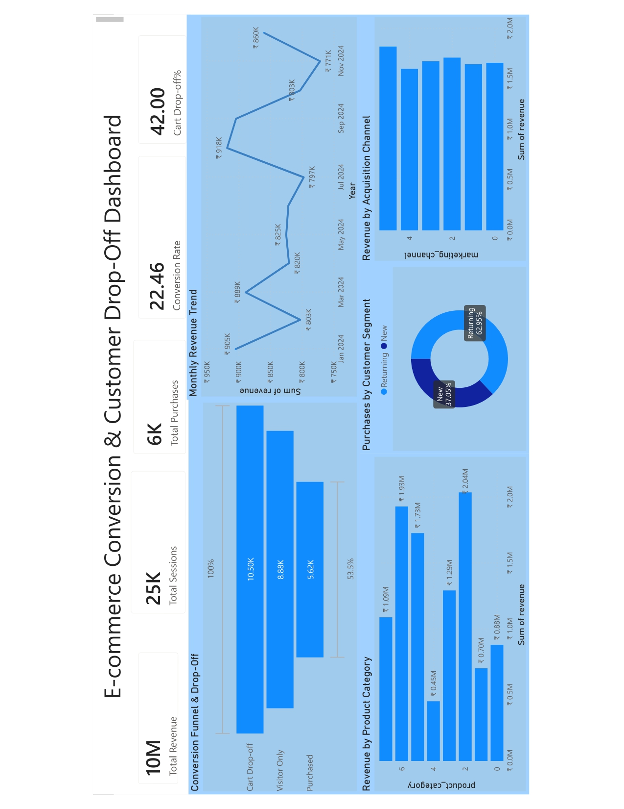

# 🛒 E-commerce Conversion & Customer Drop-off Analysis

_Analyzing user behavior across the purchase funnel to identify drop-offs and improve conversion performance using SQL, Excel, and Power BI._

---

## 📌 Table of Contents
- <a href="#overview">Overview</a>
- <a href="#business-problem">Business Problem</a>
- <a href="#dataset">Dataset</a>
- <a href="#tools--technologies">Tools & Technologies</a>
- <a href="#analysis--key-findings">Analysis & Key Findings</a>
- <a href="#-sql-queries">SQL Queries</a>
- <a href="#dashboard">Dashboard</a>
- <a href="#final-recommendations">Final Recommendations</a>
- <a href="#author--contact">Author & Contact</a>

---

<h2>Overview</h2>

This project analyzes customer activity within an e-commerce platform to understand how users move through the purchase funnel and where they drop off.

The analysis focuses on conversion performance, customer segmentation, product contribution, and marketing effectiveness to identify opportunities for improving revenue.

---

<h2>Business Problem</h2>

E-commerce platforms often lose potential customers during the purchase journey. This project aims to:
- Identify major drop-off points in the funnel
- Measure conversion efficiency
- Understand customer behavior across segments
- Evaluate product and marketing performance

---

<h2>Dataset</h2>

- Dataset used in this project: [Dataset Link](https://www.kaggle.com/datasets/kundanbedmutha/indian-e-commerce-customer-behavior-and-purchase)

---
<h2>Tools & Technologies</h2>

- Excel (Data validation and basic preprocessing)
- SQL (Data extraction and KPI calculation)
- Power BI (Dashboard and visualization)

---

<h2>Analysis & Key Findings</h2>

1. **Overall Conversion**: Out of **25,038 total sessions**, **5,622 resulted in purchases**, giving a conversion rate of **22.45%**
2. **Cart Abandonment**: The cart abandonment rate is **42.02%**, indicating a significant drop-off before purchase completion and a major opportunity to improve revenue
3. **Returning Customers**: Returning customers contribute **~63% of total revenue (6.3M)**, showing strong repeat purchase behavior
4. **Revenue Concentration**: Revenue is driven by a limited set of product categories, indicating partial revenue concentration
5. **Device Performance**: Conversion rates across devices are consistent (~22–23%), suggesting no major device-specific issues
6. **Marketing Channels**: The top marketing channel generates over **1.8M in revenue**, outperforming others in acquisition effectiveness

---

<h2>📂 SQL Queries</h2>

All SQL queries used in this project can be found here:  
[View SQL Queries](sql/ecommerce_queries.sql)

---

<h2>Dashboard</h2>

The Power BI dashboard provides insights into:
- Funnel performance
- Customer segments
- Product contribution
- Monthly trends
- Device and marketing performance

---

<h2>Final Recommendations</h2>

- Optimize checkout flow to reduce cart abandonment
- Retarget users who abandon carts
- Focus on high-performing marketing channels
- Leverage returning customers through loyalty strategies
- Promote top-performing product categories

---

<h2>Author & Contact</h2>

**Arnav Jha**  
Data Analyst
- 📧 Email: (arnavjha3112@gmail.com) 
- 🔗 [LinkedIn](https://www.linkedin.com/in/arnavkumarjha/)
- 🐙 [Github](https://github.com/arnavjha-3112)
